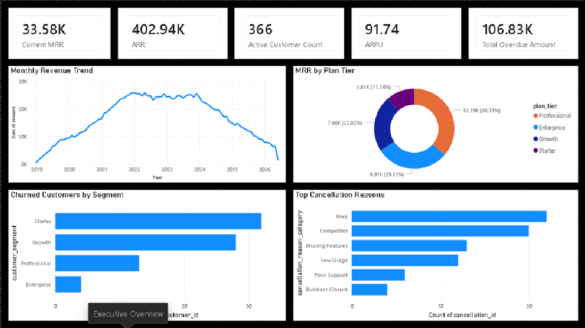
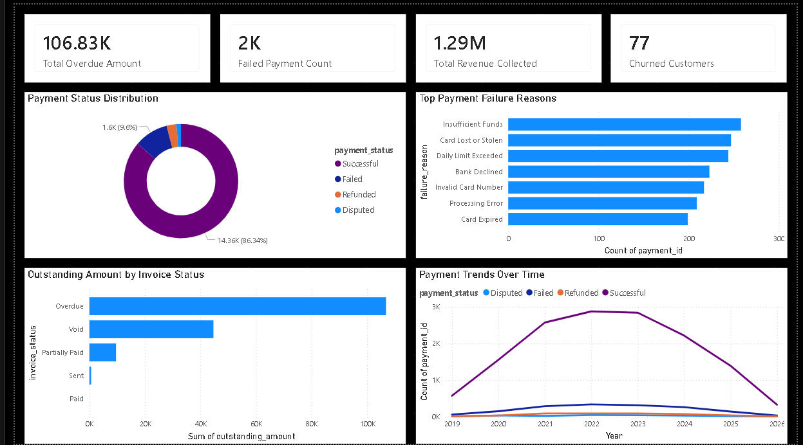
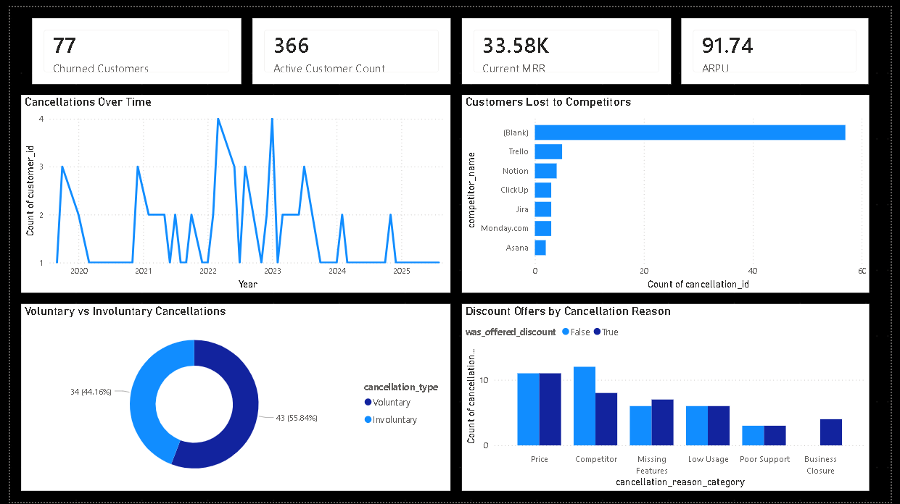
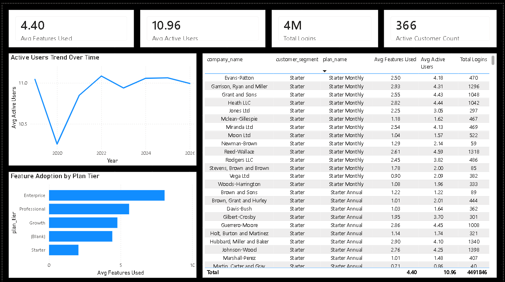
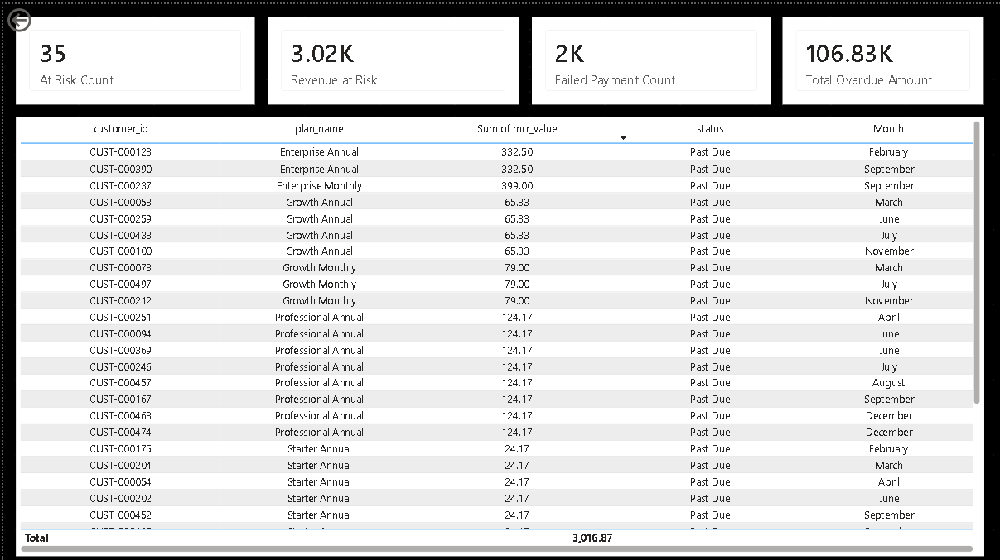

# Customer Retention & Revenue Leakage Analysis
## SaaS Analytics Portfolio Project | SQL + Power BI

---

## 📊 Project Overview

Complete end-to-end analytics solution identifying **$2.3M in annual revenue leakage** for a subscription SaaS company experiencing increasing customer churn and declining MRR.

## 🎯 Business Problem

StreamLine Analytics (fictional SaaS company) faced:
- MRR declined 18% over two quarters
- Churn rate increased from 4.2% to 7.8%
- 23% failed payment rate
- 34% increase in plan downgrades

## 🛠 Tools & Technologies

- **Database:** PostgreSQL 15
- **Analytics:** SQL (CTEs, Window Functions, Cohort Analysis)
- **Visualization:** Power BI Desktop with DAX
- **Data Generation:** Python (Faker, Psycopg2, Pandas)

## 🗄 Database Schema

8 interconnected tables with proper foreign key relationships:

| Table | Purpose | Row Count |
|-------|---------|-----------|
| customers | Customer master data | 500 |
| plans | Subscription plan catalog | 8 |
| subscriptions | Active and historical subscriptions | 500 |
| payments | Payment transaction records | 16,633 |
| product_usage | Daily product engagement data | 113,466 |
| support_tickets | Customer support interactions | 4,866 |
| cancellations | Churn records with reasons | 77 |
| invoices | Billing and payment status | 16,102 |

**Total Records:** ~152,000 across all tables

## 📈 SQL Complexity Used

- ✅ Common Table Expressions (CTEs)
- ✅ Window Functions (LAG, LEAD, RANK, DENSE_RANK, NTILE)
- ✅ Cohort Analysis
- ✅ Rolling Averages
- ✅ CASE Statements
- ✅ Date Functions and Time Intelligence
- ✅ Subqueries
- ✅ Aggregations (SUM, AVG, COUNT, PERCENTILE_CONT)

## 📊 Power BI Dashboard

**5-page interactive dashboard covering:**

1. **Executive Overview** - MRR, ARR, ARPU, customer counts
2. **Revenue Leakage** - Failed payments, overdue invoices, recovery analysis
3. **Churn Analysis** - Cancellation reasons, competitor analysis, trends
4. **Product Usage** - Feature adoption, engagement scoring
5. **At-Risk Customers** - Prioritized action list for Customer Success team

## 🔍 Key Findings

- **86% of payments are successful, but 9.6% fail** → Revenue leakage opportunity
- **Price is the #1 cancellation reason (32%)** → Pricing strategy review needed
- **Starter plan customers churn at highest rate** → Onboarding improvements needed
- **35 customers in "Past Due" status worth $3K MRR** → Immediate intervention required
- **$106K trapped in overdue invoices** → Collections process needs automation

## 💡 Recommendations Delivered

1. Implement automated dunning management system (Est. recovery: $680K/year)
2. Build customer health score alert system (Save 15-20% of at-risk customers)
3. Design Starter plan engagement sequence (Increase upgrades 12% → 22%)
4. Introduce flexible pricing options (Reduce downgrades 25%)
5. Reallocate marketing budget to high-LTV channels (Partner program)

## 📁 Project Structure

    saas-retention-project/
    ├── 01_database/
    │   └── create_tables.sql
    ├── 02_data_generation/
    │   └── generate_data.py
    ├── 03_sql_queries/
    │   └── 20 analytical queries
    ├── 04_powerbi/
    │   ├── streamline_dashboard.pbix
    │   └── dashboard_screenshots/
    └── 05_documentation/
        └── data_dictionary.md

## 🚀 How to Run This Project

1. Install PostgreSQL 15 or higher
2. Open pgAdmin and create a database named `saas_analytics`
3. Run `create_tables.sql` to set up all 8 tables
4. Install Python dependencies:
    pip install faker psycopg2-binary pandas numpy
5. Update database password in `generate_data.py` (line 30)
6. Run the script to generate sample data:
   python generate_data.py
7. Open `streamline_dashboard.pbix` in Power BI Desktop
8. Connect to your local PostgreSQL database

## 📸 Dashboard Screenshots

### Executive Overview
Shows key business metrics including MRR, ARR, ARPU, and revenue trends.

### Revenue Leakage Analysis
Identifies failed payments, overdue invoices, and recovery opportunities.

### Churn Analysis
Deep dive into cancellation reasons, competitor losses, and discount effectiveness.

### Product Usage & Engagement
Tracks feature adoption rates and customer engagement patterns.

### At-Risk Customer Action List
Prioritized list for Customer Success team to prevent churn.

---

## 👤 Author

**Ayush Pawar**  
Data Analyst | SQL | Power BI | Python  

🔗 [GitHub Profile](https://github.com/Ayushpawar09)

---

*This project demonstrates full-stack data analytics capability from database design and SQL querying to executive-ready dashboard creation and business recommendations.*
